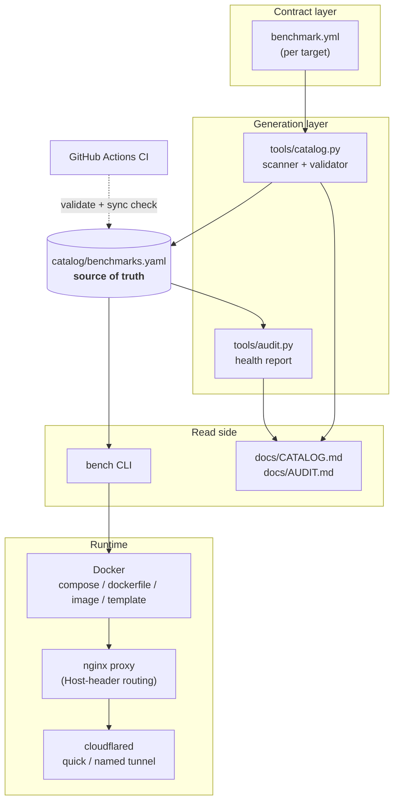
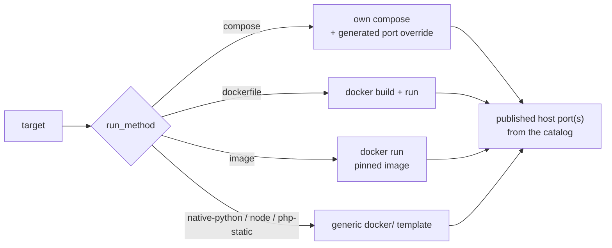
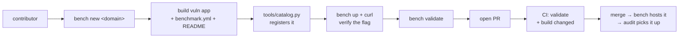
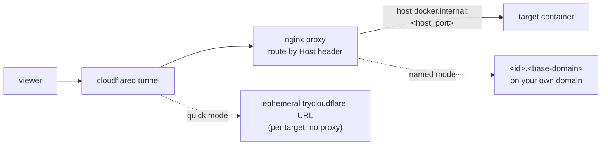

# Architecture

This repository is a heterogeneous corpus of intentionally vulnerable targets
that were each authored independently, in whatever shape their upstream source
came in. The goal of the tooling layer is to make that corpus **uniformly
discoverable and hostable** without rewriting every target.

The design is a **hub-and-spoke around one declarative source of truth**
(`catalog/benchmarks.yaml`): the scanner writes it, and the CLI, docs, and audit
read it, so everything agrees by construction.

## Architecture diagrams

The diagrams below render inline on GitHub (native mermaid). The component
diagram's source is also kept standalone at
[`docs/diagrams/architecture.mmd`](diagrams/architecture.mmd); render it to
SVG/PNG with any mermaid renderer, e.g.:

```bash
npx @mermaid-js/mermaid-cli -i docs/diagrams/architecture.mmd -o docs/diagrams/architecture.svg
```

### A. Components and data flow (the hub)



### B. Hosting dispatch (`bench up`)



### C. Contribution flow (adding a machine)



### D. Exposure path (`bench proxy` + `bench tunnel`)



## 1. The catalog (`catalog/benchmarks.yaml`)

The single source of truth. One entry per target, carrying everything the
orchestrator and the docs need:

```yaml
- id: aq-cloud-ben01
  domain: cloud
  path: Cloud/aq-cloud-ben01
  title: "AWS-S3-Public-Loot ..."
  vuln_class: "Public S3 bucket (read) ..."
  run_method: native-python      # how bench should launch it
  host_port: 8501                 # assigned, collision-free
  internal_port: 9131             # what the app actually listens on
  compose_file: ""                # set for run_method: compose
  dockerfile: ""                  # set for run_method: dockerfile
  image: ""                       # set for run_method: image
  hostable: true
  needs_review: false             # scanner wasn't fully sure -> verify
  enabled: true
```

Keeping this as data (not code) means the docs, the port map, and the CLI all
agree by construction, and a human can correct any single fact in one place.

## 2. The scanner (`tools/catalog.py`)

Walks the domain directories and **classifies** each target rather than
requiring every target to be pre-annotated:

- Detects the run method by inspecting the files present (own compose? own
  Dockerfile? `app.py`/`server.js`? PHP source? nothing runnable?).
- Detects the internal listen port from compose port mappings, `EXPOSE`,
  `app.run(...)`, gunicorn bind strings, or `listen(...)`.
- Assigns a stable host port from a per-domain base plus the target's index, so
  the map is deterministic and never collides.
- Pulls a title, vulnerability class, and difficulty from the target's README.

Design choices that keep it trustworthy:

- **Conservative, not clever.** When it cannot determine a fact it records a
  safe default and sets `needs_review: true` instead of guessing silently.
- **Idempotent and non-destructive.** Re-running preserves hand-curated fields
  (title, vuln class, run method, port, notes) so human corrections survive a
  regenerate. Run `python3 tools/catalog.py --check` in CI to detect drift.
- **Special cases are explicit.** The flagship OWASP suite under `Web/.OWASP`
  (DVWA, Juice Shop, WebGoat/WebWolf, BodgeIt, and nginx portals) is registered
  as one compose target that runs on its own curated 5200-5205 ports.

## 3. The orchestrator (`bench`)

A stdlib + PyYAML CLI that turns a catalog entry into a running container. It
never modifies the targets; it wraps them:

- **Own compose** → runs it under an isolated Compose project (`bench-<id>`)
  with a generated override that republishes ports onto the assigned host port
  using Compose's `!override` tag. This isolates targets from each other and
  resolves the pervasive port collisions in the raw files (many targets publish
  5000, 8000, or 80).
- **Own Dockerfile** → `docker build` then `docker run -p host:internal`.
- **Upstream image** → `docker run` the pinned image.
- **The OWASP suite** → its own `docker-compose.host.yml`, run as-is on its
  native 5200-5205 ports (marked `native_ports`, so bench does not remap it).
- **Source only** → one of the generic templates in [`docker/`](../docker/),
  with the build context set to the target's own directory.

Every container is labelled `bench=1` and named `bench-<id>` so teardown and
status queries are reliable.

### The Flask bind problem

Some native Python targets hardcode `app.run(host="127.0.0.1", ...)`, which is
unreachable through a published Docker port. Rather than patch each target,
`docker/python.Dockerfile` bakes in a tiny launcher that monkeypatches
`Flask.run` to force `host="0.0.0.0"` while preserving the target's own port.
This makes the entire `native-python` class reachable without editing a single
target.

## The contribution contract

Discovery is no longer purely heuristic. Each target declares itself in a
`benchmark.yml` manifest (see [TARGET_SPEC.md](TARGET_SPEC.md)); the scanner
treats it as authoritative and fills only the fields it omits from heuristics.
New targets must ship a manifest, validated in CI with `bench validate`; the
pre-existing targets keep working through heuristics and are backfilled over
time. This makes third-party contributions declarative and safe to merge.

`bench new <domain>` scaffolds a target from `templates/<run>/`, filling the id,
domain, and author into a manifest + Dockerfile/compose + README skeleton.

## Exposure layer (proxy + tunnel)

Two thin layers sit in front of the already-working local ports:

- **`bench proxy`** generates one nginx `server` block per running, exposed
  target (`<id>.<base-domain>` → `host.docker.internal:<host_port>`) into
  `.bench/nginx/conf.d/`, then runs an `nginx:alpine` container. It reuses the
  X-Forwarded + redirect-rewrite pattern the maintainer established in
  `Web/.OWASP`, so apps behind it see correct host/scheme.
- **`bench tunnel`** fronts either one target's port (a zero-config quick
  tunnel) or the nginx proxy (a named tunnel on the maintainer's domain, whose
  ingress `bench` generates from the running exposed set).

Because the proxy talks to targets over `host.docker.internal`, nothing about
how targets run has to change to expose them. Full workflow in
[TUNNELING.md](TUNNELING.md).

## What is out of scope

`android`, `ios`, and `Machines` cannot be meaningfully containerised — they
are Gradle/Xcode source trees and VulnHub VM images that need an emulator,
Xcode, or VirtualBox. The catalog lists them as `offline` with build pointers,
and the per-domain guides in [`docs/domains/`](domains/) document how to run
them. The `bench` CLI reports them under `list --all` but does not try to host
them.

## Extending

- **Add a target** → drop it in its domain folder, run `python3 tools/catalog.py`,
  review the new entry (fix anything flagged), commit. See
  [`CONTRIBUTING.md`](../CONTRIBUTING.md).
- **Change the port ranges** → edit the `port_base` values in
  `tools/catalog.py` and regenerate.
- **Add a run method** → add a launcher branch in `bench` and teach the scanner
  to classify it.
